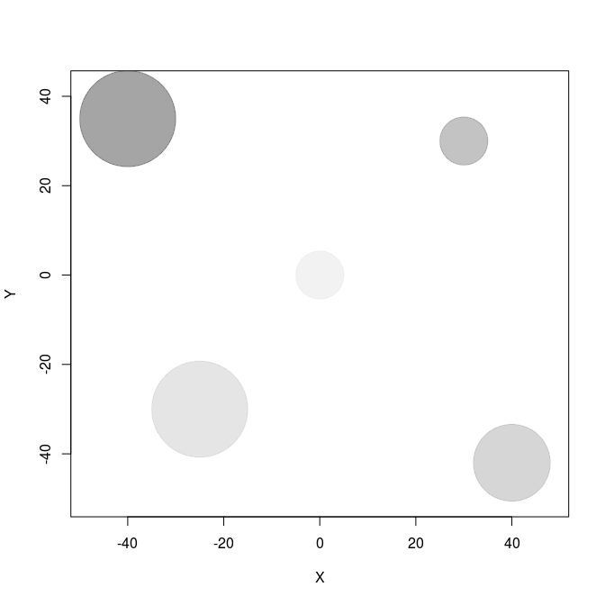

SpatIS tutorial: Spatial Individual Specialization Index
================
Appendix 1. Kerches-Rogeri, P.; Niebuhr, B. B.; Muylaert, R. L., Mello, M. A. R. Individual specialization in the use of space by frugivorous bats. In prep.

Introduction
============

Individuals are naturally different and heterogeneous within populations. These differences reflect in their physiology, morphology, as well as in their behavior and preferences. To investigate the causes and consequences of interindividual variation, Bolnick et al. [(2003)](http://www.journals.uchicago.edu/doi/abs/10.1086/343878) have related that with niche theory and coined the term "individual specialization". According to this concept, a specialist individual would be one whose niche is much narrower than the niche of the population it is part of. In turn, to be considered generalist a population can follow different scenarios: to be composed by generalist individuals, by specialists individuals with distinct niches, or even by a gradient between this two extremes.

In this context, the niche is generally represented by the type and amount of food items or other resources that are consumed by individuals. As resources are heterogeneously distributed in space in different habitats, it is expected that individual specialization leaves its shadow over space, or even that different environments or space itself may be viewed as resources, so that individuals may be more or less specialists regarding their movement patterns, habitat selection, and use of space.

Here we describe how to calculate the Spatial Individual Specialization index (*SpatIS*) using the R function `SpatIS`, based on movement data of individuals of the same population. We also use the function `SpatIS_randomize` to test if the *SpatIS* for a population is significant, i.e., different from what it would be expected at random, if (at least some of) individuals were not specialists in their use of space. To that end, first we simulate a virtual landscape with some different resources located heterogeously in space. Then we simulate five individuals that present preferences for different types of resources, which is reflected in their movement patterns. Finally we calculate *SpatIS* and run `SpatIS_randomize` to test for significance and statistical power for this simulated population.

Simulating space and individuals
================================

To represent the resources spread in space, we are going to create five resource items (e.g. trees) located in a bidimensional landscape at locations (-40,35), (30,30), (40,-42), (-25,-30), and (0,0), with different sizes (or radii, in meters: 10, 5, 8, 10, 5). To draw that, we use the function `draw_circle` from [plotrix](https://cran.r-project.org/web/packages/plotrix/index.html) package.

``` r
# Load library
library(plotrix)

# Location of resources
x.resources <- c(-40, 30, 40, -25, 0) 
y.resources <- c(35, 30, -42, -30, 0)
radius <- c(10, 5, 8, 10, 5)

# Draw landscape with prefered resources
cols <- grey.colors(length(x.resources), alpha = 0.5) # colors for each resource
# draw a landscape that encompasses the position of all resources
matplot(x.resources, y.resources, type="n", 
        xlim=c(1.2*min(x.resources),1.2*max(x.resources)),
        ylim=c(1.2*min(y.resources),1.2*max(y.resources)), 
        xlab = "X", ylab = "Y") 
for(i in 1:length(x.resources)) {
  draw.circle(x.resources[i], y.resources[i], radius = radius[i], border = cols[i], 
              col = cols[i]) # draw resources
}
```



To generate individual trajectories we are going to simulate 100-step paths of five individuals that follow a biased random walk, i.e., a random walk with attraction from a certain point in space (here defined by the location of resource items). Each individual starts near the origin (0,0) and will move biased to a different resource item, with greater or lower intensity, which represents their preference for distinct resources at different degrees. This is the only possible mechanism that may generate individuals to present different movement and space use patterns, but it was used here to generate location points and exemplify the application of *SpatIS*.

Biased random walk code was adapted from [Prof. Juan M. Morales](https://sites.google.com/site/pajarom/). The step length of walks is difined by a Weibull distribution (with shape and scale parameters) and turning angles are drawn from a wrapped Cauchy distribution (with *μ* and *ρ* parameters). In turn, the prefered direction of travel *μ* is a function of *β*, the coeffient of attraction or bias, which controls how strongly individuals' movements are biased towards a certain resource. Below we simulate these five tracks.

``` r
# Load library circular
library(circular)

# Seed for random number generation
set.seed(122)

# Random walk parameters
# Coefficient of attraction or bias - positive values correspond to attraction, 
#   negative values correspond to avoidance
beta <- c(1.5, 2, 1.8, 2.2, 0.1) 
rho <- 0.6 # Concentration parameter around the bias absolute angle
scale <- 1 # Scale of the Weibull distribution for step length
shape <- 1 # Shape of the Weibull distribution for step length

# Number of individuals
ntracks <- 5
# Number of steps per trajectory/individual
nsteps <- 100

# Matrices of x and y locations - initialized with NA
X <- matrix(NA, nsteps, ntracks)
Y <- matrix(NA, nsteps, ntracks)

# Coordinates of the point of attraction/repulsion for each individual
# These correspond to the 5 different resources created in the landscape
xh <- x.resources
yh <- y.resources

# Simulating tracks
for(i in 1:ntracks){
  x <- numeric(nsteps)
  y <- numeric(nsteps) 
  h <- numeric(nsteps)
  steps <- numeric(nsteps)
  
  # Initial positions of all individuals around the point (0,0)
  h[1] <- runif(1,1,2*pi)
  x[1] <- rnorm(1,0,1)
  y[1] <- rnorm(1,0,1)
  
  # Simulating following positions
  for(t in 2:nsteps){  
    adj <- xh[i] - x[t-1]
    op  <- yh[i] - y[t-1]
    r   <- sqrt(adj^2 + op^2)
    ya <- sin(h[t-1]) + beta[i]*(op/r)
    xa <- cos(h[t-1]) + beta[i]*(adj/r)    
    m_t <- atan2(ya,xa)
    h[t] <- rwrappedcauchy(1,mu=circular(m_t),rho=rho)
    steps[t-1] <- rweibull(1,scale=scale, shape=shape)
    x[t] <- x[t-1] + cos(h[t])*steps[t-1]
    y[t] <- y[t-1] + sin(h[t])*steps[t-1]
  } 
  X[,i] <- x
  Y[,i] <- y
}

# Draw landscape with prefered resources
matplot(X,Y, type="n", xlim=c(1.4*min(X),1.4*max(X)), ylim=c(1.4*min(Y),1.4*max(Y)))
for(i in 1:length(x.resources)) {
  draw.circle(x.resources[i], y.resources[i], radius = radius[i], border = cols[i], 
              col = cols[i])
}

# Plot individual trajectories
matplot(X, Y, type="l", pch=16, col=1:ntracks, asp=1, 
        xlim=c(min(X),max(X)), ylim=c(min(Y),max(Y)), add = T)
```


Calculating SpatIS
==================

To calculate *SpatIS*, first we have to load the `SpatIS` function. To do that we may use the `source` function, loading it directly from [Github](https://github.com/LEEClab/SpatIS/blob/master/code/spatis_source_code_v1_0.R) - which may not run depending on your Operational System - or [downloading SpatIS source code into your local computer](https://github.com/LEEClab/SpatIS/archive/master.zip), unpacking it and loading it from your local environment. Below we show both options.

``` r
# Loading from the web
# source("https://github.com/LEEClab/SpatIS/blob/master/code/spatis_source_code.R")

# Loading from the local environment, after downloading and unpacking
# Path to code folder in your computer
codedir <- "/home/leecb/Github/SpatIS/code/"
source(paste(codedir, "spatis_source_code_v1_0.R", sep = ""))
```

Then it is necessary to transform individuals' locations into a SpatialPointsDataFrame (a data frame with spatial information embedded; take a look [here](https://cran.r-project.org/web/packages/sp/vignettes/intro_sp.pdf) for more information), so that one of the columns indicates the individual ID. Below we show an example of how the space use data may be organized and how it looks like after the transformation into a SpatialPointsDataFrame.

``` r
# Organizing individual locations as an example of tabular data
ids <- sapply(1:ncol(X), rep, times = nrow(X)) # Generating array of IDs
ids.vector <- as.vector(ids)
X.vector <- as.vector(X) # Array of x positions
Y.vector <- as.vector(Y) # Array of y positions

# Creating a data frame with an ID column that represents individuals
data <- data.frame(ID = ids.vector, X = X.vector, Y = Y.vector)

# This is how the original data may look like
head(data)
```

    ##   ID         X         Y
    ## 1  1 1.3216090 -1.740196
    ## 2  1 1.5943292 -1.466210
    ## 3  1 0.7755649  1.762281
    ## 4  1 0.8398471  1.803869
    ## 5  1 0.3697159  1.910707
    ## 6  1 0.2945413  2.348632

``` r
# Transforming the original data into a SpatialPointsDataFrame
spdata <- SpatialPointsDataFrame(coords = cbind(data$X, data$Y), 
                                 data = subset(data, select = -c(X,Y)))

# This is how the SpatialPointsDataFrame will look like
head(spdata)
```

    ##           coordinates ID
    ## 1  (1.32161, -1.7402)  1
    ## 2 (1.59433, -1.46621)  1
    ## 3 (0.775565, 1.76228)  1
    ## 4 (0.839847, 1.80387)  1
    ## 5 (0.369716, 1.91071)  1
    ## 6 (0.294541, 2.34863)  1
    ## Coordinate Reference System (CRS) arguments: NA

After transforming the original data, it easy to run `SpatIS` with this SpatialPointsDataFrame as input by specifying which column corresponds to individual ID. `SpatIS` is based on `kerneloverlap` function from [adehabitatHR package](https://cran.r-project.org/web/packages/adehabitatHR/vignettes/adehabitatHR.pdf) and calculates the overlap in the utilization distribution (using any of the methods of `kerneloverlap` function, look [here](https://www.rdocumentation.org/packages/adehabitatHR/versions/0.4.14/topics/kerneloverlap) for more details) between individuals and the whole population (assumed to be the combination of all individuals sampled).

There are two options for calling `SpatIS`. One is to create in the input SpatialPointsDataFrame a "new individual" that represents the population, with locations of all individuals gathered, and pass the "population ID" as one of the arguments when calling `SpatIS`. The other one is to let the function do it for you, if you have not done it yet (in this case, the option `population.ID` should be set to `NULL`). As we still do not have the locations and an ID that represents all the population, we are going to run the second (and easiest) option. We put the results into an object called `observed.SpatIS`.

``` r
# Reploting data
# cor <- rainbow(length(unique(spdata$ID)))
# plot(coordinates(spdata)[,1], coordinates(spdata)[,2], type = "n")
# points(spdata, pch = 20, col = cor[as.factor(spdata$ID)])

# Calculating SpatIS and throwing the results into the object observed.SpatIS
observed.SpatIS <- SpatIS(spdata, individuals.col = "ID")
```

The result of `SpatIS` is a list of four elements:

1.  `data`: The input locations points, with the points that represent the whole population appended in the end (in our case, they receive an ID "all"):

``` r
# First lines
head(observed.SpatIS$data)
```

    ##           coordinates ID
    ## 1  (1.32161, -1.7402)  1
    ## 2 (1.59433, -1.46621)  1
    ## 3 (0.775565, 1.76228)  1
    ## 4 (0.839847, 1.80387)  1
    ## 5 (0.369716, 1.91071)  1
    ## 6 (0.294541, 2.34863)  1
    ## Coordinate Reference System (CRS) arguments: NA

``` r
# Last lines
tail(observed.SpatIS$data)
```

    ##              coordinates  ID
    ## 995   (-4.3938, 6.79819) all
    ## 996  (-5.91664, 6.63695) all
    ## 997  (-5.99262, 6.48406) all
    ## 998   (-6.6824, 4.99822) all
    ## 999  (-6.65972, 4.89188) all
    ## 1000 (-6.56448, 4.39379) all
    ## Coordinate Reference System (CRS) arguments: NA

1.  `parms`: The parameters used as input to call `SpatIS`:

``` r
# Parameters
observed.SpatIS$parms
```

    ## $individuals.col
    ## [1] "ID"
    ## 
    ## $population.ID
    ## [1] "all"
    ## 
    ## $method
    ## [1] "VI"

1.  `SpatIS.individual`: the value of the Spatial Individual Specialization index for each individual (i.e., the level of overlap between their utilization distribution and the population's utilization distribution):

``` r
# Individual SpatIS
observed.SpatIS$SpatIS.individual
```

    ##         1         2         3         4         5 
    ## 0.6661083 0.6567337 0.7330505 0.6594467 0.7847597

1.  `SpatIS.population`: the value of the Spatial Individual Specialization index for the whole population, defined as the SpatIS averaged over individuals:

``` r
# Population SpatIS
observed.SpatIS$SpatIS.population
```

    ## [1] 0.7000198

Plotting 95% kernels to represent the overlap in space use between individuals and the population
-------------------------------------------------------------------------------------------------

Below we plot the 95% kernel isopleths for each individuald and the whole population to illustrate the overlap in their space use. The line in black show the population isopleth, and the colors represent different individuals.

``` r
# Calculate utilization distributions
spdata <- observed.SpatIS$data
ids <- unique(spdata$ID)
UDs <- list()
for(i in 1:length(ids)) {
  kud <- adehabitatHR::kernelUD(spdata[,1][spdata$ID == ids[i],], h = "href")
  UDs[[i]] <- kud
}

# Drawing the landscape and the 95% kernel isoplepths
colors <- c(rainbow(length(ids)-1), "black") # the last one is for the whole population
for(i in (1:length(ids))) {
  kernel95 <- adehabitatHR::getverticeshr(UDs[[i]], percent = 95)
  if(i == 1){
    # Draw the virtual landscape
    
    # Draw a landscape that emcompasses the position of all resources
    matplot(x.resources, y.resources, type="n", 
            xlim=c(1.2*min(x.resources), 1.2*max(x.resources)),
            ylim=c(1.2*min(y.resources),1.2*max(y.resources)), 
            xlab = "X", ylab = "Y") 
    for(j in 1:length(x.resources)) {
      draw.circle(x.resources[j], y.resources[j], radius = radius[j], border = cols[j], 
                  col = cols[j]) # draw resources
    }
  }
  plot(kernel95, border=colors[i], lwd = 2, add = T)
}
```


Calculating population SpatIS significance
==========================================

To check whether the population SpatIS observed is different from random, we use the function `SpatIS_randomize`. This function recalculates the population SpatIS value after randomizing the population locations between individuals. This randomization procedure is repeated a number of times (the default is `iterations = 99`) and used to calculated significance (a *p* value) through a comparison (a *t test*) between the distributions of observed and expected (after randomization of locations) individual SpatIS values. The randomization process may be a bootstrap (randomize locations with replacement) or a permutation procedure (without replacement; this option is controled by the argument `bootstrap`, which may be `TRUE` or `FALSE`) and the significance is calculated based on an alpha threshold (`alpha` parameter; default is `0.05`). The input used for running `SpatIS_randomize` is the list that results from `SpatIS` function. The function also plots (if `plot = TRUE`) how far is the observed value (in red) from permutated ones.

The output is a list with the random SpatIS values , the observed SpatIS calculated through `SpatIS` function (both for the individuals and the whole population), and the significance object (the result of a *t test*), and two objects regarding statistical power analysis.

``` r
# Run permutation
permutations <- SpatIS_randomize(observed.SpatIS, iterations = 99)
```


``` r
# Show permutation results
permutations
```

    ## $SpatIS.individual.random
    ## $SpatIS.individual.random[[1]]
    ##         1         2         3         4         5 
    ## 0.1707348 0.1374825 0.1073056 0.1433062 0.1330633 
    ## 
    ## $SpatIS.individual.random[[2]]
    ##         1         2         3         4         5 
    ## 0.1162337 0.1489972 0.1550887 0.1241637 0.1497323 
    ## 
    ## $SpatIS.individual.random[[3]]
    ##         1         2         3         4         5 
    ## 0.1516096 0.1472358 0.1716225 0.1495451 0.1595318 
    ## 
    ## $SpatIS.individual.random[[4]]
    ##         1         2         3         4         5 
    ## 0.1562656 0.1476658 0.1585091 0.1211658 0.1312960 
    ## 
    ## $SpatIS.individual.random[[5]]
    ##         1         2         3         4         5 
    ## 0.1376681 0.1657535 0.1094994 0.1378960 0.1462531 
    ## 
    ## $SpatIS.individual.random[[6]]
    ##         1         2         3         4         5 
    ## 0.1133671 0.1205456 0.1285809 0.1696069 0.1477160 
    ## 
    ## $SpatIS.individual.random[[7]]
    ##         1         2         3         4         5 
    ## 0.1574294 0.1628094 0.1296953 0.1162632 0.1456408 
    ## 
    ## $SpatIS.individual.random[[8]]
    ##         1         2         3         4         5 
    ## 0.1115679 0.1474828 0.1260954 0.1731202 0.1452436 
    ## 
    ## $SpatIS.individual.random[[9]]
    ##         1         2         3         4         5 
    ## 0.1057735 0.1326210 0.1454475 0.1369024 0.1505338 
    ## 
    ## $SpatIS.individual.random[[10]]
    ##         1         2         3         4         5 
    ## 0.1423995 0.1608961 0.1352261 0.1488434 0.1021002 
    ## 
    ## $SpatIS.individual.random[[11]]
    ##         1         2         3         4         5 
    ## 0.1420084 0.1303649 0.2090591 0.1299058 0.1286059 
    ## 
    ## $SpatIS.individual.random[[12]]
    ##         1         2         3         4         5 
    ## 0.1294944 0.1577537 0.1255328 0.1697504 0.1402908 
    ## 
    ## $SpatIS.individual.random[[13]]
    ##         1         2         3         4         5 
    ## 0.1385855 0.1596853 0.1219325 0.1355068 0.1290447 
    ## 
    ## $SpatIS.individual.random[[14]]
    ##         1         2         3         4         5 
    ## 0.1517538 0.1435173 0.1386865 0.1401082 0.1254401 
    ## 
    ## $SpatIS.individual.random[[15]]
    ##         1         2         3         4         5 
    ## 0.1657278 0.1381488 0.1360633 0.1306444 0.1284443 
    ## 
    ## $SpatIS.individual.random[[16]]
    ##         1         2         3         4         5 
    ## 0.1305450 0.1328363 0.1127100 0.1482109 0.1700532 
    ## 
    ## $SpatIS.individual.random[[17]]
    ##         1         2         3         4         5 
    ## 0.1342359 0.1917451 0.1662201 0.1069736 0.1372510 
    ## 
    ## $SpatIS.individual.random[[18]]
    ##         1         2         3         4         5 
    ## 0.1168686 0.1285907 0.1352141 0.1390591 0.1852887 
    ## 
    ## $SpatIS.individual.random[[19]]
    ##         1         2         3         4         5 
    ## 0.1286763 0.1131439 0.1376943 0.1660667 0.1627413 
    ## 
    ## $SpatIS.individual.random[[20]]
    ##         1         2         3         4         5 
    ## 0.1017558 0.1838497 0.1257091 0.1452683 0.1187920 
    ## 
    ## $SpatIS.individual.random[[21]]
    ##         1         2         3         4         5 
    ## 0.1049269 0.1515293 0.1357936 0.1415974 0.1321379 
    ## 
    ## $SpatIS.individual.random[[22]]
    ##         1         2         3         4         5 
    ## 0.1407897 0.1130263 0.1326206 0.1667563 0.1324305 
    ## 
    ## $SpatIS.individual.random[[23]]
    ##         1         2         3         4         5 
    ## 0.1414001 0.1383707 0.1836169 0.1159448 0.1284048 
    ## 
    ## $SpatIS.individual.random[[24]]
    ##         1         2         3         4         5 
    ## 0.1714172 0.1388321 0.1096157 0.1422219 0.1446013 
    ## 
    ## $SpatIS.individual.random[[25]]
    ##         1         2         3         4         5 
    ## 0.1514237 0.1334451 0.1149397 0.1286115 0.1206108 
    ## 
    ## $SpatIS.individual.random[[26]]
    ##         1         2         3         4         5 
    ## 0.1256586 0.1319333 0.1229294 0.1562876 0.1321291 
    ## 
    ## $SpatIS.individual.random[[27]]
    ##         1         2         3         4         5 
    ## 0.1561248 0.1326830 0.1347571 0.1806463 0.1290197 
    ## 
    ## $SpatIS.individual.random[[28]]
    ##         1         2         3         4         5 
    ## 0.1489119 0.1576448 0.1489292 0.1527773 0.1248228 
    ## 
    ## $SpatIS.individual.random[[29]]
    ##         1         2         3         4         5 
    ## 0.1385001 0.1371687 0.1287443 0.1460824 0.1599204 
    ## 
    ## $SpatIS.individual.random[[30]]
    ##         1         2         3         4         5 
    ## 0.1376906 0.1284686 0.1590935 0.1488924 0.1531334 
    ## 
    ## $SpatIS.individual.random[[31]]
    ##         1         2         3         4         5 
    ## 0.1400833 0.1493001 0.1444736 0.1594480 0.1110815 
    ## 
    ## $SpatIS.individual.random[[32]]
    ##         1         2         3         4         5 
    ## 0.1934626 0.1282779 0.1311741 0.1491602 0.1096502 
    ## 
    ## $SpatIS.individual.random[[33]]
    ##         1         2         3         4         5 
    ## 0.1690970 0.1390271 0.1474996 0.1130752 0.1205991 
    ## 
    ## $SpatIS.individual.random[[34]]
    ##         1         2         3         4         5 
    ## 0.1414664 0.1213910 0.1275086 0.1557562 0.1159639 
    ## 
    ## $SpatIS.individual.random[[35]]
    ##         1         2         3         4         5 
    ## 0.1327011 0.1431017 0.1293069 0.1389504 0.1294885 
    ## 
    ## $SpatIS.individual.random[[36]]
    ##          1          2          3          4          5 
    ## 0.14205186 0.21948914 0.15788081 0.09876937 0.11990668 
    ## 
    ## $SpatIS.individual.random[[37]]
    ##         1         2         3         4         5 
    ## 0.1339850 0.1024108 0.1561030 0.1581552 0.1408075 
    ## 
    ## $SpatIS.individual.random[[38]]
    ##         1         2         3         4         5 
    ## 0.1479805 0.1608084 0.1168847 0.1229589 0.1416701 
    ## 
    ## $SpatIS.individual.random[[39]]
    ##         1         2         3         4         5 
    ## 0.1780776 0.1332656 0.1007980 0.1233876 0.1528905 
    ## 
    ## $SpatIS.individual.random[[40]]
    ##         1         2         3         4         5 
    ## 0.1561679 0.1476649 0.1184066 0.1196257 0.1492627 
    ## 
    ## $SpatIS.individual.random[[41]]
    ##         1         2         3         4         5 
    ## 0.1536073 0.1351388 0.1206296 0.1448821 0.1478451 
    ## 
    ## $SpatIS.individual.random[[42]]
    ##         1         2         3         4         5 
    ## 0.1691420 0.1296812 0.1321953 0.1398712 0.1041164 
    ## 
    ## $SpatIS.individual.random[[43]]
    ##         1         2         3         4         5 
    ## 0.1529467 0.1426411 0.1247684 0.1157111 0.1239180 
    ## 
    ## $SpatIS.individual.random[[44]]
    ##         1         2         3         4         5 
    ## 0.1423196 0.1264746 0.1657829 0.1214053 0.1288684 
    ## 
    ## $SpatIS.individual.random[[45]]
    ##         1         2         3         4         5 
    ## 0.1385161 0.1635092 0.1184840 0.1501485 0.1515731 
    ## 
    ## $SpatIS.individual.random[[46]]
    ##         1         2         3         4         5 
    ## 0.1169767 0.1420802 0.1380781 0.1257982 0.1790074 
    ## 
    ## $SpatIS.individual.random[[47]]
    ##         1         2         3         4         5 
    ## 0.1667921 0.1376125 0.1307453 0.1510200 0.1070299 
    ## 
    ## $SpatIS.individual.random[[48]]
    ##         1         2         3         4         5 
    ## 0.1427696 0.1018023 0.1340299 0.1194082 0.1669270 
    ## 
    ## $SpatIS.individual.random[[49]]
    ##         1         2         3         4         5 
    ## 0.1417634 0.1212838 0.1390035 0.1282492 0.1543689 
    ## 
    ## $SpatIS.individual.random[[50]]
    ##         1         2         3         4         5 
    ## 0.1763095 0.1274095 0.1273557 0.1472835 0.1337271 
    ## 
    ## $SpatIS.individual.random[[51]]
    ##         1         2         3         4         5 
    ## 0.1171913 0.1958078 0.1241152 0.1418485 0.1169471 
    ## 
    ## $SpatIS.individual.random[[52]]
    ##         1         2         3         4         5 
    ## 0.1742433 0.1423073 0.1210530 0.1092505 0.1478251 
    ## 
    ## $SpatIS.individual.random[[53]]
    ##         1         2         3         4         5 
    ## 0.1505579 0.1430947 0.1375460 0.1085742 0.1373387 
    ## 
    ## $SpatIS.individual.random[[54]]
    ##         1         2         3         4         5 
    ## 0.1073352 0.1434382 0.1179385 0.1495029 0.1431021 
    ## 
    ## $SpatIS.individual.random[[55]]
    ##         1         2         3         4         5 
    ## 0.1253691 0.1421353 0.1328418 0.1474507 0.1493161 
    ## 
    ## $SpatIS.individual.random[[56]]
    ##         1         2         3         4         5 
    ## 0.1262333 0.1980105 0.1336562 0.1384137 0.1199221 
    ## 
    ## $SpatIS.individual.random[[57]]
    ##         1         2         3         4         5 
    ## 0.1476452 0.1425651 0.1084809 0.1519438 0.1398663 
    ## 
    ## $SpatIS.individual.random[[58]]
    ##         1         2         3         4         5 
    ## 0.1479819 0.1517512 0.1496851 0.1205248 0.1255855 
    ## 
    ## $SpatIS.individual.random[[59]]
    ##         1         2         3         4         5 
    ## 0.1431659 0.1654327 0.1135840 0.1502160 0.1444088 
    ## 
    ## $SpatIS.individual.random[[60]]
    ##         1         2         3         4         5 
    ## 0.1106993 0.1779159 0.1138148 0.1114870 0.1728960 
    ## 
    ## $SpatIS.individual.random[[61]]
    ##          1          2          3          4          5 
    ## 0.14164881 0.09766109 0.17024080 0.12676359 0.16354495 
    ## 
    ## $SpatIS.individual.random[[62]]
    ##         1         2         3         4         5 
    ## 0.1274084 0.1333612 0.1415151 0.1399867 0.1432012 
    ## 
    ## $SpatIS.individual.random[[63]]
    ##         1         2         3         4         5 
    ## 0.1372346 0.1150635 0.1759578 0.1206604 0.1435679 
    ## 
    ## $SpatIS.individual.random[[64]]
    ##         1         2         3         4         5 
    ## 0.1226667 0.1484523 0.1426793 0.1127531 0.1454699 
    ## 
    ## $SpatIS.individual.random[[65]]
    ##         1         2         3         4         5 
    ## 0.1348791 0.1289687 0.1400330 0.1194567 0.1531236 
    ## 
    ## $SpatIS.individual.random[[66]]
    ##         1         2         3         4         5 
    ## 0.1336802 0.1287624 0.1231833 0.1727400 0.1240374 
    ## 
    ## $SpatIS.individual.random[[67]]
    ##         1         2         3         4         5 
    ## 0.1494701 0.1353877 0.1549871 0.1261745 0.1272778 
    ## 
    ## $SpatIS.individual.random[[68]]
    ##         1         2         3         4         5 
    ## 0.1645908 0.1894331 0.1343483 0.1089202 0.1398000 
    ## 
    ## $SpatIS.individual.random[[69]]
    ##         1         2         3         4         5 
    ## 0.1522769 0.1475203 0.1183343 0.1188785 0.1288966 
    ## 
    ## $SpatIS.individual.random[[70]]
    ##         1         2         3         4         5 
    ## 0.1648134 0.1330783 0.1251348 0.1311896 0.1291670 
    ## 
    ## $SpatIS.individual.random[[71]]
    ##         1         2         3         4         5 
    ## 0.1209454 0.1930159 0.1120270 0.1389735 0.1392773 
    ## 
    ## $SpatIS.individual.random[[72]]
    ##         1         2         3         4         5 
    ## 0.1559116 0.1318777 0.1174956 0.1481912 0.1391789 
    ## 
    ## $SpatIS.individual.random[[73]]
    ##         1         2         3         4         5 
    ## 0.1302897 0.1399151 0.1347152 0.1232344 0.1832070 
    ## 
    ## $SpatIS.individual.random[[74]]
    ##         1         2         3         4         5 
    ## 0.1269760 0.1586688 0.1286951 0.1343830 0.1756414 
    ## 
    ## $SpatIS.individual.random[[75]]
    ##         1         2         3         4         5 
    ## 0.1673316 0.1084872 0.1195078 0.1424720 0.1473213 
    ## 
    ## $SpatIS.individual.random[[76]]
    ##         1         2         3         4         5 
    ## 0.1509848 0.1156085 0.1353149 0.1313190 0.1304156 
    ## 
    ## $SpatIS.individual.random[[77]]
    ##         1         2         3         4         5 
    ## 0.1447885 0.1726400 0.1489997 0.1368290 0.1357301 
    ## 
    ## $SpatIS.individual.random[[78]]
    ##         1         2         3         4         5 
    ## 0.1313979 0.1036451 0.1461368 0.1898247 0.1578795 
    ## 
    ## $SpatIS.individual.random[[79]]
    ##         1         2         3         4         5 
    ## 0.1074670 0.1691882 0.1666528 0.1309119 0.1191813 
    ## 
    ## $SpatIS.individual.random[[80]]
    ##         1         2         3         4         5 
    ## 0.1356511 0.1732763 0.1240474 0.1436389 0.1275421 
    ## 
    ## $SpatIS.individual.random[[81]]
    ##         1         2         3         4         5 
    ## 0.1325265 0.1330343 0.1373259 0.1552816 0.1342327 
    ## 
    ## $SpatIS.individual.random[[82]]
    ##         1         2         3         4         5 
    ## 0.1133041 0.1534059 0.1633193 0.1376209 0.1253942 
    ## 
    ## $SpatIS.individual.random[[83]]
    ##         1         2         3         4         5 
    ## 0.1249036 0.1249530 0.1376075 0.1835401 0.1898727 
    ## 
    ## $SpatIS.individual.random[[84]]
    ##         1         2         3         4         5 
    ## 0.1371989 0.1335684 0.1597072 0.1300657 0.1340759 
    ## 
    ## $SpatIS.individual.random[[85]]
    ##         1         2         3         4         5 
    ## 0.1211738 0.1111179 0.1355614 0.1852584 0.1604004 
    ## 
    ## $SpatIS.individual.random[[86]]
    ##         1         2         3         4         5 
    ## 0.1476715 0.1524688 0.1153010 0.1300670 0.1183915 
    ## 
    ## $SpatIS.individual.random[[87]]
    ##         1         2         3         4         5 
    ## 0.1413420 0.1272137 0.1531483 0.1326146 0.1511811 
    ## 
    ## $SpatIS.individual.random[[88]]
    ##         1         2         3         4         5 
    ## 0.1487800 0.1671880 0.1625368 0.1129288 0.1287845 
    ## 
    ## $SpatIS.individual.random[[89]]
    ##         1         2         3         4         5 
    ## 0.1445966 0.1253522 0.1725317 0.1375628 0.1162616 
    ## 
    ## $SpatIS.individual.random[[90]]
    ##         1         2         3         4         5 
    ## 0.1677353 0.1362853 0.1479885 0.1062169 0.1260848 
    ## 
    ## $SpatIS.individual.random[[91]]
    ##         1         2         3         4         5 
    ## 0.1337615 0.1397283 0.1434412 0.1355117 0.1125433 
    ## 
    ## $SpatIS.individual.random[[92]]
    ##         1         2         3         4         5 
    ## 0.1447384 0.1198641 0.1083623 0.1460672 0.1918107 
    ## 
    ## $SpatIS.individual.random[[93]]
    ##         1         2         3         4         5 
    ## 0.2048360 0.1215787 0.1172395 0.1378020 0.1319383 
    ## 
    ## $SpatIS.individual.random[[94]]
    ##         1         2         3         4         5 
    ## 0.1207812 0.1158109 0.1352608 0.1509445 0.1554270 
    ## 
    ## $SpatIS.individual.random[[95]]
    ##         1         2         3         4         5 
    ## 0.1186561 0.1482363 0.1464808 0.1682328 0.1157113 
    ## 
    ## $SpatIS.individual.random[[96]]
    ##         1         2         3         4         5 
    ## 0.1364273 0.1395657 0.1291064 0.1415800 0.1675740 
    ## 
    ## $SpatIS.individual.random[[97]]
    ##         1         2         3         4         5 
    ## 0.1395772 0.1214925 0.1193350 0.1650655 0.1437706 
    ## 
    ## $SpatIS.individual.random[[98]]
    ##         1         2         3         4         5 
    ## 0.1555189 0.1230167 0.1575882 0.1489392 0.1210841 
    ## 
    ## $SpatIS.individual.random[[99]]
    ##         1         2         3         4         5 
    ## 0.1387953 0.1465538 0.1122758 0.1155059 0.1513902 
    ## 
    ## 
    ## $SpatIS.individual.observed
    ##         1         2         3         4         5 
    ## 0.6661083 0.6567337 0.7330505 0.6594467 0.7847597 
    ## 
    ## $SpatIS.population.random
    ##  [1] 0.1383785 0.1388431 0.1559090 0.1429805 0.1394140 0.1359633 0.1423676
    ##  [8] 0.1407020 0.1342556 0.1378931 0.1479888 0.1445644 0.1369510 0.1399012
    ## [15] 0.1398057 0.1388711 0.1472851 0.1410042 0.1416645 0.1350750 0.1331970
    ## [22] 0.1371247 0.1415475 0.1413376 0.1298062 0.1337876 0.1466462 0.1466172
    ## [29] 0.1420832 0.1454557 0.1408773 0.1423450 0.1378596 0.1324172 0.1347097
    ## [36] 0.1476196 0.1382923 0.1380605 0.1376839 0.1382256 0.1404206 0.1350012
    ## [43] 0.1319971 0.1369701 0.1444462 0.1403881 0.1386399 0.1329874 0.1369338
    ## [50] 0.1424171 0.1391820 0.1389358 0.1354223 0.1322634 0.1394226 0.1432472
    ## [57] 0.1381003 0.1391057 0.1433615 0.1373626 0.1399718 0.1370945 0.1384969
    ## [64] 0.1344042 0.1352922 0.1364807 0.1386594 0.1474185 0.1331813 0.1366766
    ## [71] 0.1408478 0.1385310 0.1422723 0.1448728 0.1370240 0.1327286 0.1477975
    ## [78] 0.1457768 0.1386802 0.1408312 0.1384802 0.1386089 0.1521754 0.1389232
    ## [85] 0.1427024 0.1327800 0.1411000 0.1440436 0.1392610 0.1368622 0.1329972
    ## [92] 0.1421685 0.1426789 0.1356449 0.1394635 0.1428507 0.1378482 0.1412294
    ## 
    ## $SpatIS.population.observed
    ## [1] 0.7000198
    ## 
    ## $SpatIS.significance
    ## 
    ##  Welch Two Sample t-test
    ## 
    ## data:  observed and expected.polled
    ## t = 22.021, df = 4.0099, p-value = 1.234e-05
    ## alternative hypothesis: true difference in means is greater than 0
    ## 5 percent confidence interval:
    ##  0.6147306       Inf
    ## sample estimates:
    ## mean of x mean of y 
    ## 0.7000198 0.1395139 
    ## 
    ## 
    ## $SpatIS.power
    ## [1] 1
    ## 
    ## $SpatIS.power.curve
    ##   n power
    ## 1 2     1
    ## 2 3     1
    ## 3 4     1
    ## 4 5     1

Citation
========

If you need more information or use *SpatIS*, please refer to

Kerches-Rogeri, P.; Niebuhr, B. B.; Muylaert, R. L., Mello, M. A. R. Individual specialization in the space use of frugivorous bats. *In prep.*

Additional references
=====================

Bolnick, D. I. et al. 2003. [The ecology of individuals: incidence and implications of individual specialization](https://digitalcommons.tacoma.uw.edu/cgi/viewcontent.cgi?referer=https://scholar.google.com.br/&httpsredir=1&article=1563&context=ias_pub). American Naturalist, 161, 1–28.

Calenge, C. 2006. [The package adehabitat for the R software: a tool for the analysis of space and habitat use by animals](https://ase-research.org/calenge/Calenge_2006.pdf). Ecological Modelling, 197, 516-519.

Prof. Juan Manuel Morales webpage. <https://sites.google.com/site/pajarom/>.
